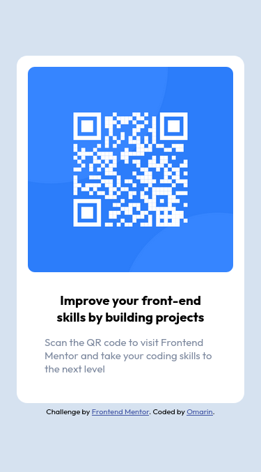
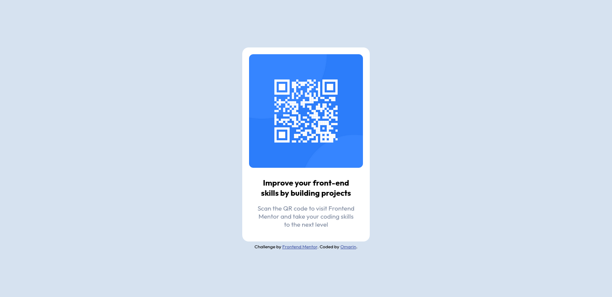

# Frontend Mentor - QR code component solution

This is a solution to the [QR code component challenge on Frontend Mentor](https://www.frontendmentor.io/challenges/qr-code-component-iux_sIO_H). Frontend Mentor challenges help you improve your coding skills by building realistic projects. 

## Table of contents

- [Overview](#overview)
  - [Screenshot](#screenshot)
  - [Links](#links)
- [My process](#my-process)
  - [Built with](#built-with)
  - [What I learned](#what-i-learned)
  - [Continued development](#continued-development)
  - [Useful resources](#useful-resources)
- [Author](#author)
- [Acknowledgments](#acknowledgments)

## Overview

### Screenshot
Mobile        |  Desktop
:-------------------------:|:-------------------------:
 |

Add a screenshot of your solution. The easiest way to do this is to use Firefox to view your project, right-click the page and select "Take a Screenshot". You can choose either a full-height screenshot or a cropped one based on how long the page is. If it's very long, it might be best to crop it.

### Links

- Solution URL: [https://github.com/O-Marin/FM-QR-challenge](https://github.com/O-Marin/FM-QR-challenge)
- Live Site URL: [https://o-marin.github.io/FM-QR-challenge/](https://o-marin.github.io/FM-QR-challenge/)

## My process

### Built with

- Semantic HTML5 markup
- CSS custom properties
- Flexbox
- Mobile-first workflow

### Continued development

I realize I need to learn and deep dive on responsive design

## Author

- Website - [o-marin]()
- Frontend Mentor - [@O-Marin](https://www.frontendmentor.io/profile/O-Marin)

## Acknowledgments

no acknowledgments in this one.N